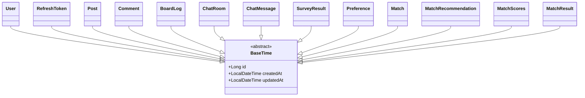

# Entity 설계서

## 문서 정보

- **프로젝트명**: every moment
- **작성자**: 1조/최대현
- **작성일**: 2025-09-15
- **버전**: v1.0
- **검토자**: 최대현
- **승인자**:

---

## 1. Entity 설계 개요

### 1.1 설계 목적

> JPA Entity 설계를 통해 ORM 매핑을 정의하고, 도메인(회원/게시판/채팅/매칭)을 코드로 표현하여 유지보수성과 확장성을 확보

### 1.2 설계 원칙

- **단일 책임**: 하나의 Entity = 하나의 개념
- **캡슐화**: 비즈니스 규칙은 Entity/도메인서비스로
- **불변성 지향**: 변경 메서드 최소화, 생성자/팩토리 활용
- **연관 최소화**: 필요한 범위만 양방향
- **성능 우선**: LAZY 기본, 인덱스/페치 전략 명시

### 1.3 기술 스택

- **ORM**: Spring Data JPA 3.x
- **DB**: MariaDB 10.11 (utf8mb4, InnoDB)
- **검증**: Bean Validation 2.0
- **감사**: Spring Data JPA Auditing

---

## 2. Entity 목록 및 분류

### 2.1 Entity 분류 매트릭스

| Entity명                | 유형 | 비즈니스 중요도 | 기술적 복잡도 | 연관관계 수 | 우선순위 |
| ----------------------- | ---- | --------------- | ------------- | ----------- | -------- |
| **User**                | 핵심 | 높음            | 중간          | 6           | 1순위    |
| **RefreshToken**        | 지원 | 중간            | 낮음          | 1           | 2순위    |
| **Post**                | 핵심 | 높음            | 중간          | 2           | 1순위    |
| **Comment**             | 핵심 | 중간            | 낮음          | 2           | 1순위    |
| **BoardLog**            | 이력 | 중간            | 낮음          | 1           | 2순위    |
| **ChatRoom**            | 핵심 | 높음            | 낮음          | 2           | 1순위    |
| **ChatMessage**         | 핵심 | 높음            | 중간          | 2           | 1순위    |
| **SurveyResult**        | 핵심 | 중간            | 낮음          | 1           | 2순위    |
| **Preference**          | 핵심 | 중간            | 낮음          | 1           | 2순위    |
| **Match**               | 핵심 | 높음            | 중간          | 2           | 1순위    |
| **MatchRecommendation** | 지원 | 중간            | 낮음          | 2           | 2순위    |
| **MatchScores**         | 이력 | 중간            | 낮음          | 1           | 3순위    |
| **MatchResult**         | 이력 | 중간            | 낮음          | 1           | 3순위    |

### 2.2 Entity 상속 구조



---

## 3. 공통 설계 규칙

### 3.1 네이밍 규칙

| 구분            | 규칙             | 예시                   | 비고        |
| --------------- | ---------------- | ---------------------- | ----------- |
| Entity 클래스명 | PascalCase(단수) | `User`, `ChatRoom`     |             |
| 테이블명        | snake_case(복수) | `users`, `chat_room`   |             |
| 컬럼명          | snake_case       | `created_at`           |             |
| FK 컬럼         | snake_case_id    | `user_id`, `room_id`   |             |
| Boolean         | is\_ 접두        | `is_active`, `deleted` | BIT/BOOLEAN |

### 3.2 공통 어노테이션 규칙

```java
@Entity
@Table(name = "테이블명")
@EntityListeners(AuditingEntityListener.class)
@NoArgsConstructor(access = AccessLevel.PROTECTED)
@Getter
public class EntityName {
    /*
    ...
        */
}
```

### 3.3 ID 생성 전략

| Entity      | 전략     | 이유                             |
| ----------- | -------- | -------------------------------- |
| 모든 엔티티 | IDENTITY | MariaDB Auto Increment 일관 적용 |

---

## 4. 상세 Entity 설계

### 4.1 UserEntity (`users`)

- **주요 목적**: 사용자 계정/역할/상태 및 매칭 선호 연결
- **제약/인덱스**: `UQ(email)`, `IDX(email)`

| 필드          | 타입         | Not Null | 기본값      | 설명                  |
| ------------- | ------------ | -------: | ----------- | --------------------- |
| id            | BIGINT       |        ✓ |             | PK                    |
| username      | VARCHAR(50)  |        ✓ |             | 표시 이름             |
| gender        | TINYINT      |          |             | 0=남성, 1=여성        |
| email         | VARCHAR(255) |        ✓ |             | 로그인 이메일(유니크) |
| password_hash | VARCHAR(255) |        ✓ |             | 암호 해시             |
| smoking       | BOOLEAN      |          | false       | 흡연 여부             |
| role          | VARCHAR(30)  |        ✓ | `ROLE_USER` | 권한                  |
| active        | BOOLEAN      |        ✓ | true        | 활성화                |
| preference_id | BIGINT       |          |             | 선호(옵션, 1:1 권장)  |
| created_at    | DATETIME     |        ✓ | now         | 생성시각              |
| updated_at    | DATETIME     |        ✓ | now         | 수정시각              |

**연관**: Post(1:N, author), Comment(1:N, author), Preference(1:1 권장), SurveyResult(1:1 권장), Token(N:1), ChatRoom(N:1×2), ChatMessage(N:1)

---

### 4.2 TokenEntity (`refresh_tokens`)

- **주요 목적**: 리프레시 토큰 저장/폐기
- **제약/인덱스**: `IDX(user_id)`, 필요 시 `IDX(token)`

| 필드       | 타입         | Not Null | 기본값            | 설명        |
| ---------- | ------------ | -------: | ----------------- | ----------- |
| id         | BIGINT       |        ✓ |                   | PK          |
| user_id    | BIGINT       |        ✓ |                   | 소유자 FK   |
| token      | VARCHAR(512) |        ✓ |                   | 토큰 문자열 |
| expiry     | TIMESTAMP    |        ✓ |                   | 만료 시각   |
| revoked    | BOOLEAN      |        ✓ | false             | 폐기 여부   |
| created_at | TIMESTAMP    |        ✓ | CURRENT_TIMESTAMP | 생성 시각   |

---

### 4.3 PostEntity (`posts`)

- **주요 목적**: 게시글
- **제약/인덱스**: `IDX(author_id)`, `IDX(category)`, `IDX(created_at)`

| 필드       | 타입         | Not Null | 기본값 | 설명                  |
| ---------- | ------------ | -------: | ------ | --------------------- |
| id         | BIGINT       |        ✓ |        | PK                    |
| author_id  | BIGINT       |        ✓ |        | 작성자 FK             |
| category   | VARCHAR(20)  |        ✓ |        | FREE/NOTICE/MATCH/ETC |
| title      | VARCHAR(200) |        ✓ |        | 제목                  |
| content    | TEXT         |        ✓ |        | 본문                  |
| view_count | INT          |        ✓ | 0      | 조회수                |
| deleted    | BOOLEAN      |        ✓ | false  | 소프트 삭제           |
| created_at | DATETIME     |        ✓ | now    | 생성                  |
| updated_at | DATETIME     |        ✓ | now    | 수정                  |

**연관**: Comment(1:N, `orphanRemoval=true`)

---

### 4.4 CommentEntity (`comments`)

- **주요 목적**: 게시글 댓글
- **제약/인덱스**: `IDX(post_id)`

| 필드       | 타입     | Not Null | 기본값 | 설명      |
| ---------- | -------- | -------: | ------ | --------- |
| id         | BIGINT   |        ✓ |        | PK        |
| post_id    | BIGINT   |        ✓ |        | 게시글 FK |
| author_id  | BIGINT   |        ✓ |        | 작성자 FK |
| content    | TEXT     |        ✓ |        | 내용      |
| created_at | DATETIME |        ✓ | now    | 생성      |
| updated_at | DATETIME |        ✓ | now    | 수정      |

---

### 4.5 BoardLogEntity (`board_logs`)

- **주요 목적**: 게시판 이벤트 감사 로그
- **제약/인덱스**: `IDX(user_id)`, `IDX(target_type,target_id)`

| 필드        | 타입        | Not Null | 기본값 | 설명                          |
| ----------- | ----------- | -------: | ------ | ----------------------------- |
| id          | BIGINT      |        ✓ |        | PK                            |
| user_id     | BIGINT      |        ✓ |        | 수행자 FK                     |
| action      | VARCHAR(50) |        ✓ |        | CREATE_POST/DELETE_COMMENT 등 |
| target_type | VARCHAR(20) |        ✓ |        | POST/COMMENT                  |
| target_id   | BIGINT      |        ✓ |        | 대상 ID                       |
| created_at  | DATETIME    |        ✓ | now    | 생성                          |

---

### 4.6 ChatRoom (`chat_room`)

- **주요 목적**: 1:1 채팅 방
- **제약/인덱스**: `UQ(user_a_id,user_b_id)` (1:1 중복 방 생성 방지), `IDX(user_a_id)`, `IDX(user_b_id)`

| 필드      | 타입   | Not Null | 기본값 | 설명     |
| --------- | ------ | -------: | ------ | -------- |
| id        | BIGINT |        ✓ |        | PK       |
| user_a_id | BIGINT |        ✓ |        | 참여자 A |
| user_b_id | BIGINT |        ✓ |        | 참여자 B |

> 비즈니스 규칙: 동일 쌍(A,B)에 대해 단일 방만 허용. (필요 시 `(LEAST, GREATEST)` 정규화로 순서 독립 보장)

---

### 4.7 ChatMessage (`chat_message`)

- **주요 목적**: 채팅 메시지
- **제약/인덱스**: `IDX(room_id, created_at)`, `IDX(sender_id)`

| 필드       | 타입      | Not Null | 기본값            | 설명        |
| ---------- | --------- | -------: | ----------------- | ----------- |
| id         | BIGINT    |        ✓ |                   | PK          |
| room_id    | BIGINT    |        ✓ |                   | 채팅방 FK   |
| sender_id  | BIGINT    |        ✓ |                   | 발신자 FK   |
| content    | TEXT      |        ✓ |                   | 메시지 내용 |
| created_at | TIMESTAMP |        ✓ | CURRENT_TIMESTAMP | 생성 시각   |
| read_at    | TIMESTAMP |          |                   | 읽은 시각   |

---

### 4.8 Preference (`preferences`)

- **주요 목적**: 매칭 선호 프로필(요약치)
- **제약/인덱스**: `IDX(user_id)`, (권장) `UQ(user_id)`

| 필드              | 타입     | Not Null | 기본값 | 설명           |
| ----------------- | -------- | -------: | ------ | -------------- |
| id                | BIGINT   |        ✓ |        | PK             |
| user_id           | BIGINT   |        ✓ |        | 사용자 FK      |
| sleep_time        | TINYINT  |        ✓ |        | 수면 시간 선호 |
| cleanliness       | TINYINT  |        ✓ |        | 청결도 선호    |
| noise_sensitivity | TINYINT  |        ✓ |        | 소음 민감도    |
| height            | TINYINT  |        ✓ |        | 층/높이 선호   |
| room_temp         | TINYINT  |        ✓ |        | 실내 온도 선호 |
| created_at        | DATETIME |        ✓ | now    | 생성           |
| updated_at        | DATETIME |        ✓ | now    | 수정           |

---

### 4.9 SurveyResult (`survey_results`)

- **주요 목적**: 설문 개별 응답(원본)
- **제약/인덱스**: `IDX(user_id)`

| 필드              | 타입     | Not Null | 기본값 | 설명                                |
| ----------------- | -------- | -------: | ------ | ----------------------------------- |
| id                | BIGINT   |        ✓ |        | PK                                  |
| user_id           | BIGINT   |        ✓ |        | 사용자 FK                           |
| sleep_time        | TINYINT  |        ✓ |        | 1:10시 이후, 2:1시 이후, 3:3시 이후 |
| cleanliness       | TINYINT  |        ✓ |        | 1:5-6회, 2:3-4회, 3:1-2회, 4:안함   |
| noise_sensitivity | TINYINT  |        ✓ |        | 1:예민, 2:보통, 3:둔감              |
| height            | TINYINT  |        ✓ |        | 1:저층, 2:중간, 3:고층              |
| room_temp         | TINYINT  |        ✓ |        | 범주형(주석 참조)                   |
| created_at        | DATETIME |        ✓ | now    | 생성                                |
| updated_at        | DATETIME |        ✓ | now    | 수정                                |

---

### 4.10 Match (`matches`)

- **주요 목적**: 사용자 쌍 매칭 결과(헤더)
- **제약/인덱스**: `IDX(user1_id,user2_id)`, `IDX(status)`, `IDX(created_at)`

| 필드             | 타입        | Not Null | 기본값  | 설명            |
| ---------------- | ----------- | -------: | ------- | --------------- |
| id               | BIGINT      |        ✓ |         | PK              |
| user1_id         | BIGINT      |        ✓ |         | 대상1 FK        |
| user2_id         | BIGINT      |        ✓ |         | 대상2 FK        |
| user1_score      | INT         |        ✓ |         | 사용자1 점수    |
| user2_score      | INT         |        ✓ |         | 사용자2 점수    |
| similarity_score | DOUBLE      |        ✓ |         | 유사도          |
| status           | VARCHAR(20) |        ✓ | PENDING | 매칭 상태(enum) |
| created_at       | DATETIME    |        ✓ | now     | 생성            |
| updated_at       | DATETIME    |        ✓ | now     | 수정            |

---

### 4.11 MatchScores (`match_scores`)

- **주요 목적**: 매칭 점수 상세(정규화된 스코어 저장용)
- **제약/인덱스**: `IDX(match_id)`

| 필드             | 타입     | Not Null | 기본값 | 설명         |
| ---------------- | -------- | -------: | ------ | ------------ |
| id               | BIGINT   |        ✓ |        | PK           |
| match_id         | BIGINT   |        ✓ |        | 매칭 FK      |
| user1_score      | INT      |        ✓ |        | 사용자1 점수 |
| user2_score      | INT      |        ✓ |        | 사용자2 점수 |
| similarity_score | DOUBLE   |        ✓ |        | 유사도       |
| created_at       | DATETIME |        ✓ | now    | 생성         |
| updated_at       | DATETIME |        ✓ | now    | 수정         |

---

### 4.12 MatchRecommendation (`match_recs`)

- **주요 목적**: 추천 목록(피드 카드용)
- **제약/인덱스**: `IDX(user_id)`, `IDX(status)`

| 필드             | 타입        | Not Null | 기본값  | 설명                |
| ---------------- | ----------- | -------: | ------- | ------------------- |
| id               | BIGINT      |        ✓ |         | PK                  |
| user_id          | BIGINT      |        ✓ |         | 추천 대상 사용자    |
| username         | VARCHAR(50) |        ✓ |         | 익명 처리된 이름    |
| score            | INT         |        ✓ |         | 적합도              |
| status           | VARCHAR(20) |        ✓ | PENDING | 상태 문자열         |
| roommate_name    | VARCHAR(50) |        ✓ |         | 룸메이트 이름(익명) |
| preference_score | DOUBLE      |        ✓ |         | 선호도(0~100)       |
| created_at       | DATETIME    |        ✓ | now     | 생성                |
| updated_at       | DATETIME    |        ✓ | now     | 수정                |

---

### 4.13 MatchResult (`match_results`)

- **주요 목적**: 최종 배정/사유 등 결과 저장
- **제약/인덱스**: `IDX(match_id)`, `IDX(user_id)`

| 필드            | 타입         | Not Null | 기본값  | 설명                   |
| --------------- | ------------ | -------: | ------- | ---------------------- |
| id              | BIGINT       |        ✓ |         | PK                     |
| match_id        | BIGINT       |        ✓ |         | 매칭 FK                |
| user_id         | BIGINT       |        ✓ |         | 사용자 FK              |
| match_user_id   | BIGINT       |        ✓ |         | 매칭 상대 FK           |
| score           | INT          |        ✓ |         | 점수                   |
| room_assignment | VARCHAR(100) |          |         | 예: A동 304호 (DOUBLE) |
| roommate_name   | VARCHAR(50)  |          |         | 룸메이트 이름          |
| match_reasons   | JSON/TEXT    |          |         | 사유 목록              |
| status          | VARCHAR(20)  |        ✓ | PENDING | 상태(enum)             |
| created_at      | DATETIME     |        ✓ | now     | 생성                   |
| updated_at      | DATETIME     |        ✓ | now     | 수정                   |

## 5. Enum 타입 정의

### 5.1 MatchStatus

- 허용 값: `PENDING`, `ACCEPTED`, `REJECTED`, `SWAPPED`, `CANCELLED`
- 구현 권장: DB는 `VARCHAR(16)` + 애플리케이션 ENUM 매핑

---

## 6. 연관관계 매핑 전략

- **ManyToOne**: LAZY 기본, FK 인덱스 필수
- **OneToMany**: LAZY + `mappedBy` 일관, 필요 시 `@OrderBy`
- **ManyToMany 금지**: 중간 엔티티로 대체
- **양방향 동기화 메서드** 제공 (add/remove)

---

## 7. 감사(Auditing) 설정

- 모든 엔티티 `@EntityListeners(AuditingEntityListener.class)`
- `created_at`, `updated_at` 자동 주입

---

## 8. 성능 최적화 전략

- 채팅: `chat_message(room_id, id desc)` 페이징
- 매칭: `match_recommendations(user_id, score desc)`, `matches(status, similarity_score desc)`
- 게시판: `posts(category, created_at)`, `comments(post_id)`

---

## 9. 검증 및 제약조건

- 이메일 UK, (user1,user2) 저장 전 정규화, 토큰 `revoked` 체크
- 게시글/댓글 권한: 작성자 또는 ADMIN
- ChatRoom 참가자 검증 `isParticipant(userId)`

---

## 10. 테스트 전략

- Entity 단위/리포지토리 테스트: 유니크/인덱스/상태전이 검증
- 대량 메시지/추천 상위 N 조회 성능 테스트

---

## 11. 성능 모니터링

- Hibernate SQL 로깅/통계, 슬로우 쿼리 임계값 운영(예: 1초)

---

## 12. 마이그레이션/DDL 메모

<!-- --DB 생성 -->

CREATE DATABASE IF NOT EXISTS dormdb CHARACTER SET utf8mb4 COLLATE utf8mb4_0900_ai_ci;

CREATE USER IF NOT EXISTS 'dorm'@'localhost' IDENTIFIED BY 'dormpw';

GRANT ALL PRIVILEGES ON dormdb.\* TO 'dorm'@'localhost';

FLUSH PRIVILEGES;

```sql
--users
CREATE TABLE IF NOT EXISTS users (
  id BIGINT PRIMARY KEY AUTO_INCREMENT,
  username VARCHAR(40) NOT NULL,
  gender INT NOT NULL,  -- 👈 [추가] 정수형 gender (0=남성, 1=여성)
  email VARCHAR(100) NOT NULL UNIQUE,
  password_hash VARCHAR(255) NOT NULL,
  smoking TINYINT(1) NOT NULL DEFAULT 0,
  role VARCHAR(20) NOT NULL DEFAULT 'ROLE_USER',
  active TINYINT(1) NOT NULL DEFAULT 1,
  created_at TIMESTAMP NOT NULL DEFAULT CURRENT_TIMESTAMP,
  updated_at TIMESTAMP NOT NULL DEFAULT CURRENT_TIMESTAMP ON UPDATE CURRENT_TIMESTAMP
) ENGINE=InnoDB;

CREATE INDEX IF NOT EXISTS idx_users_email ON users(email);

CREATE TABLE IF NOT EXISTS refresh_tokens (
  id BIGINT PRIMARY KEY AUTO_INCREMENT,
  user_id BIGINT NOT NULL,
  token VARCHAR(512) NOT NULL UNIQUE,
  expiry TIMESTAMP NOT NULL,
  revoked TINYINT(1) NOT NULL DEFAULT 0,
  created_at TIMESTAMP NOT NULL DEFAULT CURRENT_TIMESTAMP,
  CONSTRAINT fk_refresh_user FOREIGN KEY (user_id) REFERENCES users(id) ON DELETE CASCADE
) ENGINE=InnoDB;

--chat_room (쌍 중복 방지)
DROP TABLE IF EXISTS chat_room;
CREATE TABLE chat_room (
  id           BIGINT AUTO_INCREMENT PRIMARY KEY,
  user_a_id    BIGINT NOT NULL,
  user_b_id    BIGINT NOT NULL,
  created_at   TIMESTAMP DEFAULT CURRENT_TIMESTAMP,
  UNIQUE KEY uq_one_on_one (user_a_id, user_b_id)
) ENGINE=InnoDB;

-- 메시지 로그
DROP TABLE IF EXISTS chat_message;
CREATE TABLE chat_message (
  id           BIGINT AUTO_INCREMENT PRIMARY KEY,
  room_id      BIGINT NOT NULL,
  sender_id    BIGINT NOT NULL,
  content      TEXT   NOT NULL,
  created_at   TIMESTAMP DEFAULT CURRENT_TIMESTAMP,
  read_at      TIMESTAMP NULL,
  CONSTRAINT fk_msg_room FOREIGN KEY (room_id) REFERENCES chat_room(id) ON DELETE CASCADE
) ENGINE=InnoDB;

---
-- 게시글 테이블
CREATE TABLE IF NOT EXISTS posts (
  id BIGINT PRIMARY KEY AUTO_INCREMENT,
  author_id BIGINT NOT NULL, -- users.id (회원가입 이메일 기반)
  category VARCHAR(20) NOT NULL DEFAULT 'FREE', -- 공지/자유/매칭/기타
  title VARCHAR(200) NOT NULL,
  content TEXT NOT NULL,
  view_count INT NOT NULL DEFAULT 0,
  deleted TINYINT(1) NOT NULL DEFAULT 0,
  created_at TIMESTAMP NOT NULL DEFAULT CURRENT_TIMESTAMP,
  updated_at TIMESTAMP NOT NULL DEFAULT CURRENT_TIMESTAMP ON UPDATE CURRENT_TIMESTAMP,
  CONSTRAINT fk_post_author FOREIGN KEY (author_id) REFERENCES users(id) ON DELETE CASCADE
) ENGINE=InnoDB;

CREATE INDEX idx_posts_category ON posts(category);
CREATE INDEX idx_posts_author ON posts(author_id);

-- 댓글 테이블
CREATE TABLE IF NOT EXISTS comments (
  id BIGINT PRIMARY KEY AUTO_INCREMENT,
  post_id BIGINT NOT NULL,   -- posts.id
  author_id BIGINT NOT NULL, -- users.id
  content TEXT NOT NULL,
  created_at TIMESTAMP NOT NULL DEFAULT CURRENT_TIMESTAMP,
  updated_at TIMESTAMP NOT NULL DEFAULT CURRENT_TIMESTAMP ON UPDATE CURRENT_TIMESTAMP,
  CONSTRAINT fk_comment_post FOREIGN KEY (post_id) REFERENCES posts(id) ON DELETE CASCADE,
  CONSTRAINT fk_comment_author FOREIGN KEY (author_id) REFERENCES users(id) ON DELETE CASCADE
) ENGINE=InnoDB;

CREATE INDEX idx_comments_post ON comments(post_id);

-- 로그 테이블
CREATE TABLE IF NOT EXISTS board_logs (
  id BIGINT PRIMARY KEY AUTO_INCREMENT,
  user_id BIGINT NOT NULL, -- users.id
  action VARCHAR(50) NOT NULL, -- CREATE_POST, DELETE_COMMENT 등
  target_type VARCHAR(20) NOT NULL, -- POST / COMMENT
  target_id BIGINT NOT NULL,
  created_at TIMESTAMP NOT NULL DEFAULT CURRENT_TIMESTAMP,
  CONSTRAINT fk_log_user FOREIGN KEY (user_id) REFERENCES users(id) ON DELETE CASCADE
) ENGINE=InnoDB;

-- 매칭/설문 관련 테이블 정의 (MySQL) + 매칭 테이블 수정 (점수 및 유사도 추가)
-- =====================================================================

SET NAMES utf8mb4;
SET FOREIGN_KEY_CHECKS=0;

-- =====================================================================
-- 1) preferences 테이블 ([User 1:1] 설문선호도)
-- =====================================================================
CREATE TABLE IF NOT EXISTS preferences (
  id BIGINT PRIMARY KEY AUTO_INCREMENT,
  user_id BIGINT NOT NULL,
  sleep_time INT NOT NULL,
  cleanliness INT NOT NULL,
  noise_sensitivity INT NOT NULL,
  height INT NOT NULL,
  room_temp INT NOT NULL,
  created_at TIMESTAMP NOT NULL DEFAULT CURRENT_TIMESTAMP,  -- 생성 시 현재 시간 자동 입력
  updated_at TIMESTAMP NOT NULL DEFAULT CURRENT_TIMESTAMP ON UPDATE CURRENT_TIMESTAMP,  -- 수정 시 현재 시간 자동 업데이트
  CONSTRAINT fk_preference_user FOREIGN KEY (user_id) REFERENCES users(id) ON DELETE CASCADE,
  CONSTRAINT uk_preference_user UNIQUE (user_id)  -- 1:1 관계 보장
) ENGINE=InnoDB DEFAULT CHARSET=utf8mb4 COLLATE=utf8mb4_unicode_ci;

-- =====================================================================
-- 2) matches 테이블 (매칭 점수 및 상태)
-- =====================================================================
CREATE TABLE IF NOT EXISTS matches (
  id BIGINT PRIMARY KEY AUTO_INCREMENT,
  user1_id BIGINT NOT NULL,
  user2_id BIGINT NOT NULL,
  status ENUM('PENDING', 'ACCEPTED', 'REJECTED', 'SWAP_REQUESTED') NOT NULL,
  created_at TIMESTAMP NOT NULL DEFAULT CURRENT_TIMESTAMP,
  updated_at TIMESTAMP NOT NULL DEFAULT CURRENT_TIMESTAMP ON UPDATE CURRENT_TIMESTAMP,
  user1_score INT NOT NULL DEFAULT 0,  -- user1의 점수 추가
  user2_score INT NOT NULL DEFAULT 0,  -- user2의 점수 추가
  similarity_score DOUBLE,  -- 유사도 점수 추가
  CONSTRAINT fk_matches_user1 FOREIGN KEY (user1_id) REFERENCES users(id) ON DELETE CASCADE,
  CONSTRAINT fk_matches_user2 FOREIGN KEY (user2_id) REFERENCES users(id) ON DELETE CASCADE
) ENGINE=InnoDB DEFAULT CHARSET=utf8mb4 COLLATE=utf8mb4_unicode_ci;

CREATE INDEX idx_matches_pair ON matches(user1_id, user2_id);
CREATE INDEX idx_matches_status ON matches(status);

-- =====================================================================
-- 3) match_results 테이블 (매칭 결과)
-- =====================================================================
CREATE TABLE IF NOT EXISTS match_results (
  id BIGINT PRIMARY KEY AUTO_INCREMENT,
  user_id BIGINT NOT NULL,
  match_user_id BIGINT NOT NULL,
  score INT NOT NULL,
  room_assignment VARCHAR(255) NOT NULL,
  roommate_name VARCHAR(255) NOT NULL,
  status ENUM('PENDING', 'ACCEPTED', 'REJECTED', 'SWAP_REQUESTED') NOT NULL,
  created_at TIMESTAMP NOT NULL DEFAULT CURRENT_TIMESTAMP,
  updated_at TIMESTAMP NOT NULL DEFAULT CURRENT_TIMESTAMP ON UPDATE CURRENT_TIMESTAMP,
  CONSTRAINT fk_match_result_user FOREIGN KEY (user_id) REFERENCES users(id) ON DELETE CASCADE,
  CONSTRAINT fk_match_result_match_user FOREIGN KEY (match_user_id) REFERENCES users(id) ON DELETE CASCADE
) ENGINE=InnoDB DEFAULT CHARSET=utf8mb4 COLLATE=utf8mb4_unicode_ci;

CREATE INDEX idx_match_results_user ON match_results(user_id);
CREATE INDEX idx_match_results_pair ON match_results(user_id, match_user_id);
CREATE INDEX idx_match_results_status ON match_results(status);

-- =====================================================================
-- 4) match_result_reasons 테이블 (매칭 이유)
-- =====================================================================
CREATE TABLE IF NOT EXISTS match_result_reasons (
  id BIGINT PRIMARY KEY AUTO_INCREMENT,
  match_result_id BIGINT NOT NULL,
  reason VARCHAR(255) NOT NULL,
  CONSTRAINT fk_mr_reasons FOREIGN KEY (match_result_id) REFERENCES match_results(id) ON DELETE CASCADE
) ENGINE=InnoDB DEFAULT CHARSET=utf8mb4 COLLATE=utf8mb4_unicode_ci;

CREATE INDEX idx_mr_reasons_mrid ON match_result_reasons(match_result_id);

-- =====================================================================
-- 5) survey_results 테이블 (사용자 설문 결과)
-- =====================================================================
CREATE TABLE IF NOT EXISTS survey_results (
  id BIGINT PRIMARY KEY AUTO_INCREMENT,
  user_id BIGINT NOT NULL,
  sleep_time INT NOT NULL,
  cleanliness INT NOT NULL,
  noise_sensitivity INT NOT NULL,
  height INT NOT NULL,
  room_temp INT NOT NULL,
  created_at TIMESTAMP NOT NULL DEFAULT CURRENT_TIMESTAMP,
  updated_at TIMESTAMP NOT NULL DEFAULT CURRENT_TIMESTAMP ON UPDATE CURRENT_TIMESTAMP,
  CONSTRAINT fk_survey_result_user FOREIGN KEY (user_id) REFERENCES users(id) ON DELETE CASCADE
) ENGINE=InnoDB DEFAULT CHARSET=utf8mb4 COLLATE=utf8mb4_unicode_ci;

CREATE INDEX idx_survey_results_user ON survey_results(user_id);

SET FOREIGN_KEY_CHECKS=1;

CREATE TABLE IF NOT EXISTS match_scores (
  id BIGINT PRIMARY KEY AUTO_INCREMENT,
  match_id BIGINT NOT NULL,  -- 매칭 ID
  user1_score INT NOT NULL DEFAULT 0,  -- user1 점수, 기본값 0
  user2_score INT NOT NULL DEFAULT 0,  -- user2 점수, 기본값 0
  similarity_score DOUBLE NOT NULL DEFAULT 0.0,  -- 유사도 점수, 기본값 0
  created_at TIMESTAMP NOT NULL DEFAULT CURRENT_TIMESTAMP,  -- 생성 시간
  updated_at TIMESTAMP NOT NULL DEFAULT CURRENT_TIMESTAMP ON UPDATE CURRENT_TIMESTAMP,  -- 갱신 시간
  CONSTRAINT fk_match_scores_match FOREIGN KEY (match_id) REFERENCES matches(id) ON DELETE CASCADE,  -- 매칭 ID와 연관
  INDEX idx_match_scores_match_id (match_id)  -- 인덱스 추가
) ENGINE=InnoDB;


ALTER TABLE match_results
ADD COLUMN match_id BIGINT,
ADD CONSTRAINT fk_match_result_match FOREIGN KEY (match_id) REFERENCES matches(id);

## 13. 체크리스트

```

□ 테이블/컬럼 네이밍과 IDENTITY 전략 일관 적용
□ FK/UK/인덱스 DB 반영 확인
□ ChatMessage 페이징 인덱스 동작 확인
□ matches 저장 정규화(min,max) 보장
□ 추천 캐시 재생성/보관 주기 정의
□ Auditing 정상 동작(created_at/updated_at)
□ LAZY 직렬화 순환참조 방지(@JsonIgnore 등)

```

---

## 14. 마무리

1. 핵심 엔티티(User/Chat/Board/Match) 구조 확정
2. 매칭 상태전이·유사도 정렬·추천 캐시 인덱스 설계 반영
3. 템플릿 섹션 체계에 맞춰 **표준화된 포맷**으로 정리 완료
```
