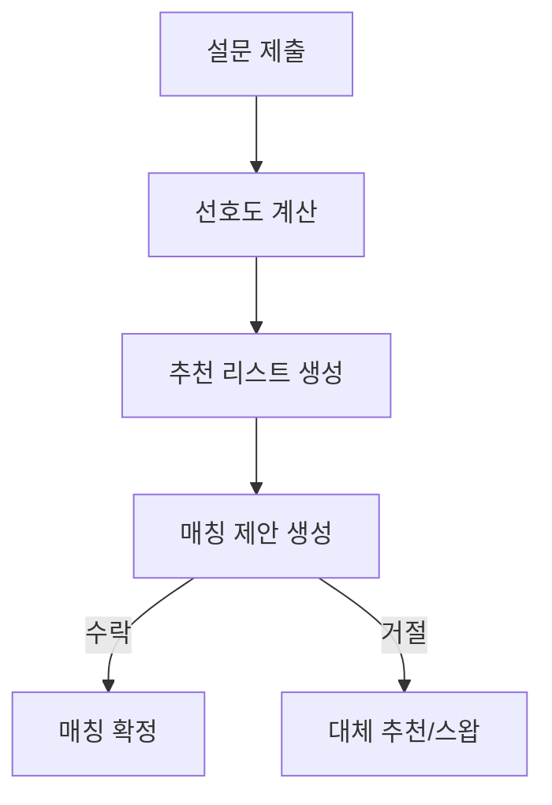
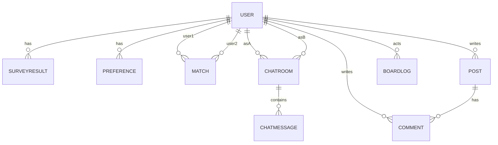

# 도메인 설계서 — every moment

## 문서 정보

- **프로젝트명**: every moment (기숙사 룸메 매칭 & 커뮤니티)
- **작성자**: 1조/최대현
- **작성일**: 2025-09-15
- **버전**: v1.0

---

## 1. 프로젝트 개요

### 1.1 프로젝트 목적

기숙사생들의 **룸메이트 매칭**, **1:1 채팅**, **커뮤니티 게시판**을 통합 제공하여 학교 생활의 질을 높이는 웹 애플리케이션.

### 1.2 프로젝트 범위

- 회원/인증(JWT) 관리
- 룸메 매칭(설문·선호도·추천·매칭 상태)
- 1:1 채팅(WebSocket + REST 이력 조회)
- 커뮤니티 게시판(게시글, 댓글, 활동 로그)
- 관리자/운영을 위한 감사 로그(BoardLog)

### 1.3 이해관계자

| 구분        | 역할          | 주요 관심사                 |
| ----------- | ------------- | --------------------------- |
| 학생 사용자 | 서비스 이용자 | 손쉬운 매칭·대화·커뮤니티   |
| 관리자      | 운영자        | 유저/게시판 관리, 로그 추적 |
| 시스템 관리 | 인프라/보안   | 인증·권한·감사·안정성       |

---

## 2. 비즈니스 도메인

### 2.1 핵심 프로세스

#### 2.1.1 룸메 매칭



- 설문(SurveyResult) → 선호도(Preference) 계산
- 추천(MatchRecommendation) 제공
- 매칭(Match) 제안/수락/거절/스왑 상태 전이

#### 2.1.2 1:1 채팅

```mermaid
graph TD
  U1[유저 A] --JWT--> S[(API)]
  S -->|POST /chat/rooms| R[ChatRoom 생성/조회]
  U1 --> WS[(WebSocket)]
  WS --> M[ChatMessage 실시간 전송]
  S -->|GET /chat/rooms/{id}/messages| H[히스토리 조회]
```

- 상대 ID로 1:1 Room 생성/조회
- 실시간 메시지, REST로 이력 페이지 조회

#### 2.1.3 게시판

- 게시글(Post) CRUD, 댓글(Comment) CRUD
- 활동 로그(BoardLog) 기록

### 2.2 비즈니스 이벤트

| 이벤트           | 트리거     | 결과                 |
| ---------------- | ---------- | -------------------- |
| 설문 제출        | 사용자     | 선호도 계산/저장     |
| 매칭 제안        | 추천 생성  | Match(PENDING) 등록  |
| 매칭 수락        | 사용자     | Match(ACCEPTED) 전환 |
| 채팅 메시지      | STOMP 송신 | DB 저장 + 상대 표시  |
| 게시글/댓글 변경 | 사용자     | BoardLog 저장        |

---

## 3. 핵심 도메인 객체

### 3.1 식별

| 객체                | 유형   | 설명                       |
| ------------------- | ------ | -------------------------- |
| User                | Entity | 회원/프로필/권한           |
| Token               | Entity | 리프레시 토큰              |
| SurveyResult        | Entity | 설문 결과(수면·청결 등)    |
| Preference          | Entity | 선호도(설문 기반 계산치)   |
| Match               | Entity | 매칭(유사도, 상태)         |
| MatchRecommendation | Entity | 추천 결과                  |
| ChatRoom            | Entity | 1:1 방 (userA, userB)      |
| ChatMessage         | Entity | 메시지(내용, 보낸이, 시간) |
| Post                | Entity | 게시글                     |
| Comment             | Entity | 댓글                       |
| BoardLog            | Entity | 활동 로그                  |

### 3.2 요약 속성/규칙

- **User**: id, username, gender(0/1), email(UK), passwordHash, smoking, role, createdAt/updatedAt
- **Token**: id, user(FK), token, expiry, revoked
- **SurveyResult**: sleepTime, cleanliness, noiseSensitivity, height, roomTemp
- **Preference**: 설문 기반 정규화/가중치 점수
- **Match**: user1, user2, user1_Score, user2_Score, similarityScore, status(PENDING/ACCEPTED/REJECTED/…)
- **ChatRoom**: userA, userB (1:1 UniqueConstraint)
- **ChatMessage**: room, sender, content, createdAt, readAt
- **Post/Comment**: 작성자, 내용, 생성/수정 시각
- **BoardLog**: targetType/targetId/action/userId/createdAt

---

## 4. 도메인 관계도



    USER(
        Long id,
        String username,
        Integer gender,
        String email,
        Boolean smoking,
        String createdAt
    )

    Post(
        Long id,
        String category,
        String title,
        String content,
        LocalDateTime createdAt,
        LocalDateTime updatedAt,
        Long authorId,
        String authorName,
        List<CommentItem> comments
    )

    PostList(
        Long id,
        String category,
        String title,
        LocalDateTime createdAt,
        String authorName
    )

    Comment(
        Long id,
        String content,
        Long authorId,
        String authorName,
        LocalDateTime createdAt
    )

    ChatMessage(
        Long roomId,
        String content,
        Instant readAt,
        UserEntity sender
    )

    ChatRoom(
        Long id,
        UserEntity userA,
        UserEntity userB
    )

    Match (
        Long proposerId,
        Long targetUserId,
        String proposalMessage
    )

    MatchRecommendation {
        Long userId,
        String username,
        Integer score,
        String status,
        String roommateName,
        Double preferenceScore
    }

    MatchResult {
        Long id
        String roomAssignment
        String roommateName
        Double preferenceScore
        List<String> matchReasons
        String matchId
        String status
    }

    MatchScore {
        Long matchId,
        Integer user1Score,
        Integer user2Score,
        Double similarityScore,
        LocalDateTime createdAt
    }

## 5. 비즈니스 규칙

- 매칭 유사도(similarityScore) 기준 정렬/제안
- 매칭 상태: `PENDING → ACCEPTED/REJECTED → SWAP(optional)`
- ChatRoom 1:1 조합 유일
- 게시글/댓글 수정/삭제는 작성자 또는 관리자만
- 토큰은 만료·회수(revoked) 필드로 관리

---

## 6. 도메인 서비스

| 서비스                     | 책임                          |
| -------------------------- | ----------------------------- |
| SurveyService              | 설문 저장/조회                |
| PreferenceService          | 선호도 계산·저장              |
| MatchService               | 매칭 제안/수락/거절/스왑      |
| MatchRecommendationService | 추천 리스트 생성              |
| ChatService                | 방 생성/검증/메시지 저장/조회 |
| PostService/CommentService | 게시판 CRUD + 권한            |
| BoardLogService            | 활동 로그 기록/조회           |
| AuthService                | 로그인/토큰/로그아웃          |
| UserService                | 인증 컨텍스트 → User          |

---

## 7. 용어

- **유사도(similarityScore)**: 양 사용자 선호도 점수 기반 산출치
- **스왑(swap)**: 거절/미스매치 시 대체 매칭 절차
- **STOMP**: WebSocket 메시징 프로토콜

---

## 8. 가정 및 제약

- 기술: Spring Boot 3, JPA, JWT, STOMP(WebSocket), MariaDB
- 보안: Bearer JWT, 권한 체크, 엔티티 직렬화 주의(LAZY @JsonIgnore)

---

## 9. 향후 확장

- 푸시 알림, 온라인 상태, 메시지 읽음/배지
- 추천 알고리즘 고도화(AI/피처 가중치)
- 신고/차단, 이미지 업로드, 알림 센터

## 10. 검토 및 승인

| 버전 | 검토자 | 검토일     | 주요 변경사항 |
| ---- | ------ | ---------- | ------------- |
| v0.1 | 최대현 | 2025-09-15 | 초안 작성     |
